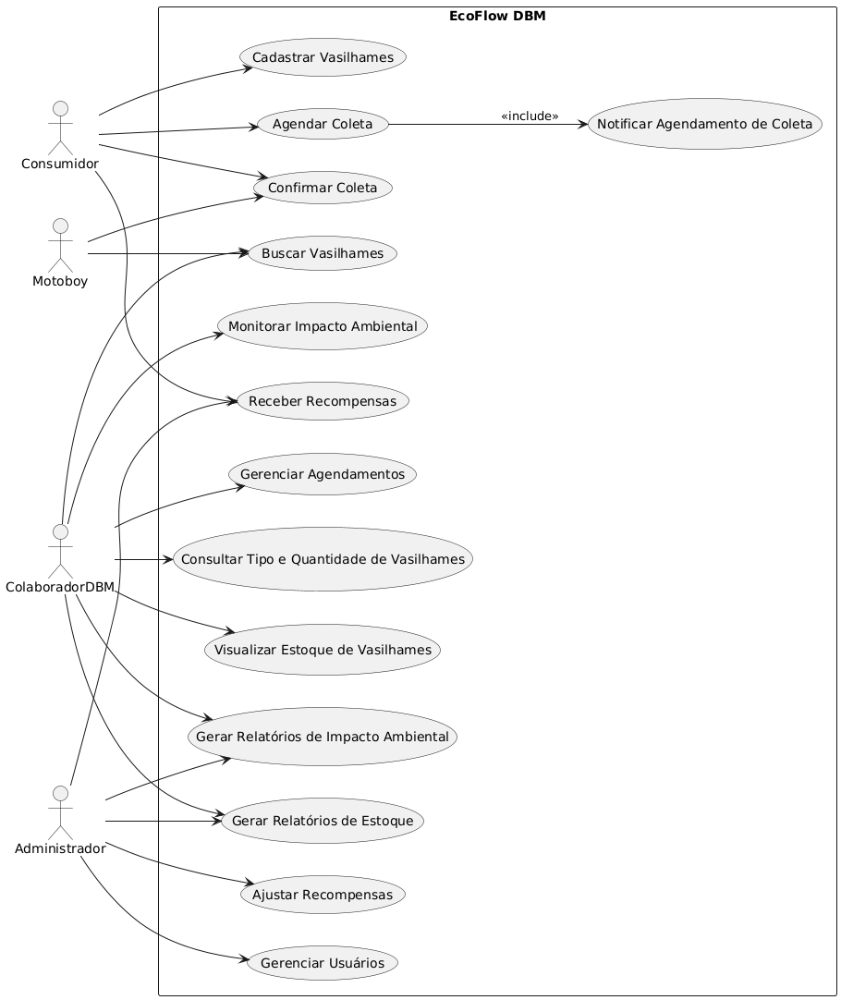

# Especificação do projeto

O problema central do projeto é o descarte inadequado de vasilhames retornáveis pela Distribuidora de Bebidas Mendes (DBM), uma empresa de pequeno porte. Muitos consumidores acumulam esses recipientes em casa por falta de opções convenientes para devolução, enquanto vasilhames quebrados ou danificados são descartados no lixo comum, gerando impacto ambiental e desperdício de materiais recicláveis. Além disso, a DBM não possui processos estruturados para coletar, higienizar ou reutilizar esses vasilhames, resultando em custos adicionais e uma imagem pouco alinhada com as demandas por sustentabilidade.

A solução proposta é o desenvolvimento de uma aplicação web chamada EcoFlow DBM, que permitirá aos consumidores agendar a coleta de vasilhames retornáveis em suas residências. A aplicação também incluirá um sistema de pontuação e recompensas para incentivar a participação, além de ferramentas para a DBM gerenciar os vasilhames coletados e monitorar o impacto ambiental do programa.

## Personas

Persona 1: Ana Souza tem 32 anos, é professora e tem grande interesse por questões ambientais. Ela está sempre em busca de maneiras de contribuir para a sustentabilidade e se preocupa com o impacto que o consumo de bebidas tem no meio ambiente. Ana gostaria de devolver os vasilhames de bebidas de forma correta e ainda ser recompensada por isso. Está procurando um sistema que facilite o agendamento de coleta de vasilhames em sua casa e, ao mesmo tempo, ofereça benefícios, como descontos em compras futuras.

 Persona 2: João Oliveira tem 45 anos, é autônomo e, embora não se importe muito com sustentabilidade, reconhece que é importante adotar práticas mais responsáveis. João está sempre em busca de benefícios práticos para suas compras e, caso seja conveniente para ele, se interessaria por participar de programas de reciclagem. Ele gostaria de entender como pode ganhar descontos ou outras vantagens ao devolver vasilhames, sem se preocupar tanto com a questão ecológica.

Persona 3: Pedro Santos tem 28 anos, é motoboy da DBM e tem como principal objetivo otimizar seu tempo durante as entregas. Ele está sempre buscando formas de tornar suas rotas mais eficientes e, por isso, precisa de informações claras sobre os pontos de coleta de vasilhames durante as entregas. Pedro quer garantir que todo o processo de coleta de vasilhames seja ágil e não atrapalhe sua rotina de trabalho.

Persona 4: Carlos Souza tem 45 anos, é motorista da Fiorino e trabalha na DBM. Ele tem como objetivo coletar vasilhames de forma eficiente durante suas rotas e contribuir para a sustentabilidade da empresa. Carlos gostaria de ter uma rota definida para coletar vasilhames descartados e receber informações claras sobre quantos vasilhames foram recolhidos em cada dia, para facilitar seu trabalho e garantir que tudo seja feito corretamente.

Persona 5: Fernanda Lima tem 40 anos, é gerente de uma unidade da DBM e tem como objetivo garantir que sua equipe esteja totalmente engajada no programa de devolução de vasilhames. Ela está sempre em busca de ferramentas que permitam acompanhar o desempenho da equipe e garantir que as metas de coleta e devolução sejam cumpridas. Fernanda quer ter um controle mais preciso sobre as atividades de sua unidade para melhorar a eficiência do processo.

Persona 6: Roberto Martins tem 55 anos, é dono da distribuidora DBM e deseja reduzir custos enquanto melhora a imagem da empresa com práticas sustentáveis. Roberto busca uma solução que ajude a empresa a monitorar o impacto do programa de devolução de vasilhames, especialmente na redução de custos operacionais e na satisfação dos clientes. Ele quer visualizar relatórios detalhados para tomar decisões estratégicas baseadas nos resultados obtidos.

Persona 7: Luiza Pereira tem 30 anos, é funcionária administrativa da DBM e tem como objetivo gerenciar os dados dos usuários e garantir que o sistema de devolução de vasilhames funcione de maneira eficiente. Luiza precisa de uma plataforma simples e intuitiva para cadastrar usuários, gerenciar pontos de recompensa e resolver qualquer problema relacionado ao programa. Ela quer garantir que todas as informações estejam atualizadas e que o processo corra sem falhas.

Persona 8: Marcos Oliveira tem 35 anos, é responsável pelo estoque da DBM e tem como objetivo controlar a entrada e saída de vasilhames e garantir que eles estejam em bom estado para reutilização. Marcos precisa registrar a quantidade de vasilhames devolvidos e monitorar seu estado para garantir que sejam reciclados ou reutilizados corretamente. Ele busca um sistema que facilite o controle de estoque e assegure a qualidade dos vasilhames para atender às necessidades da empresa e dos clientes.

## Histórias de usuários

Com base na análise das personas, foram identificadas as seguintes histórias de usuários:

|EU COMO... `PERSONA`| QUERO/PRECISO ... `FUNCIONALIDADE` |PARA ... `MOTIVO/VALOR`                 |
|--------------------|------------------------------------|----------------------------------------|
|Cliente             | Solicitar  devolução de vasilhame  | Facilitar a devolução correta de vasilhames e incentivo a práticas sustentáveis             |
|Cliente       | Solicitar  devolução de vasilhame                 | Conseguir pontos no sistemas de descontos |
|Motoboy      | Receber informações sobre onde coletar Vasilhames                | Agilizar a coleta de vasilhames e otimizar sua rotina de entregas. |
|Motorista       | Receber informações sobre a rota do dia definido                 | Garantir eficiência na coleta e contribuir para a sustentabilidade da empresa. |
|Gerente | Garantir que as metas de coleta e devolução sejam cumpridas | Melhorar a eficiência operacional |
|Dono | Monitorar impacto do programa de devolução, especialmente na redução de custos operacionais | Reduzir custos e melhorar a imagem sustentável da empresa |
|Funcionária | Realizar cadastro de usuários, gerenciar pontos de recompensa | Garantir que o sistema funcione sem falhas, mantendo os dados organizados e atualizados |
|Funcionário | Geranciar controle de entrada e saída de vasilhames, além do monitoramento do estado dos itens para garantir sua reutilização ou reciclagem | Assegurar a qualidade dos vasilhames, evitar desperdícios e garantir que a empresa tenha um estoque funcional e sustentável |

## Requisitos

As tabelas a seguir apresentam os requisitos funcionais e não funcionais que detalham o escopo do projeto. Para determinar a prioridade dos requisitos, aplique uma técnica de priorização e detalhe como essa técnica foi aplicada.

### Requisitos funcionais

|ID    | Descrição do Requisito  | Prioridade |
|------|-----------------------------------------|----|
|RF-001| Permitir que o usuário cadastre  consumidores e colaboradores | ALTA | 
|RF-002| Implementar sistema de pontuação e recompensas para quem devolver vasilhames   | ALTA |
|RF-003| Permitir que o usuário agende a coleta de vasilhames a serem descartados  | ALTA |
|RF-004| Emitir visualização de locais para coleta  | ALTA |

### Requisitos não funcionais

|ID     | Descrição do Requisito  |Prioridade |
|-------|-------------------------|----|
|RNF-001| O sistema deve possuir Interface intuitiva e de fácil usabilidade | MÉDIA | 
|RNF-002| O sistema deve ser responsivo |  MÉDIA | 
|RNF-003| O sistema deve garantir a Segurança de dados dos usuários |  ALTA | 
|RNF-004| O sistema deve possuir Escalabilidade para atender a um grande número de usuários | MÉDIA | 

## Restrições

O projeto está restrito aos itens apresentados na tabela a seguir.

|ID| Restrição                                             |
|--|-------------------------------------------------------|
|001| O projeto deverá ser entregue até o final do 1º semestre 2025 |
|002| O custo total do projeto não deve exceder o orçamento definido       |
|003| Necessidade de treinamento dos colaboradores para uso do sistema       |

## Diagrama de casos de uso

  

O diagrama de casos de uso é o próximo passo após a elicitação de requisitos. Ele utiliza um modelo gráfico e uma tabela com as descrições sucintas dos casos de uso e dos atores. O diagrama contempla a fronteira do sistema e o detalhamento dos requisitos funcionais, com a indicação dos atores, casos de uso e seus relacionamentos.

As referências abaixo irão auxiliá-lo na geração do artefato “diagrama de casos de uso”.
