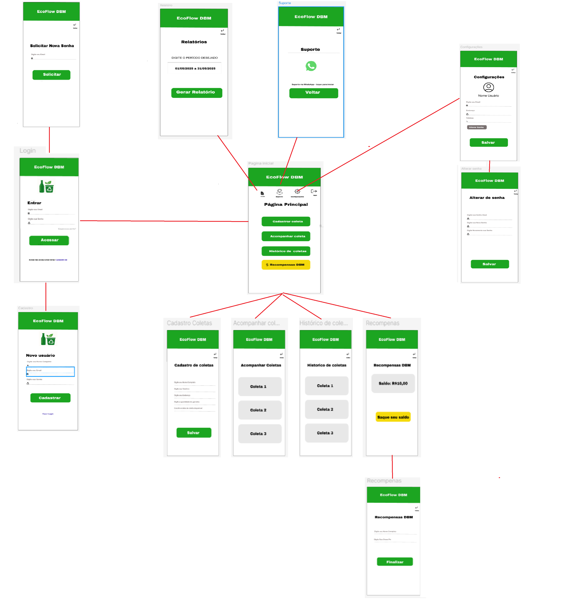
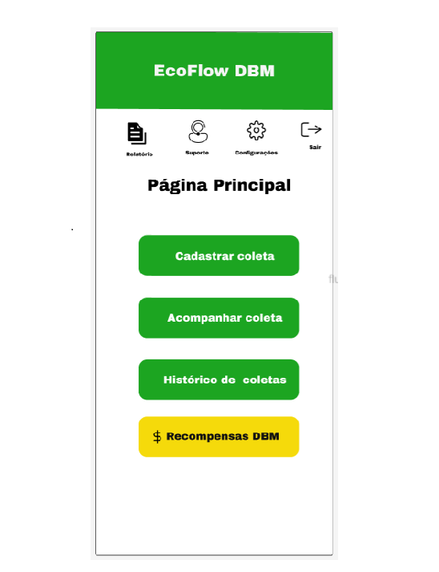
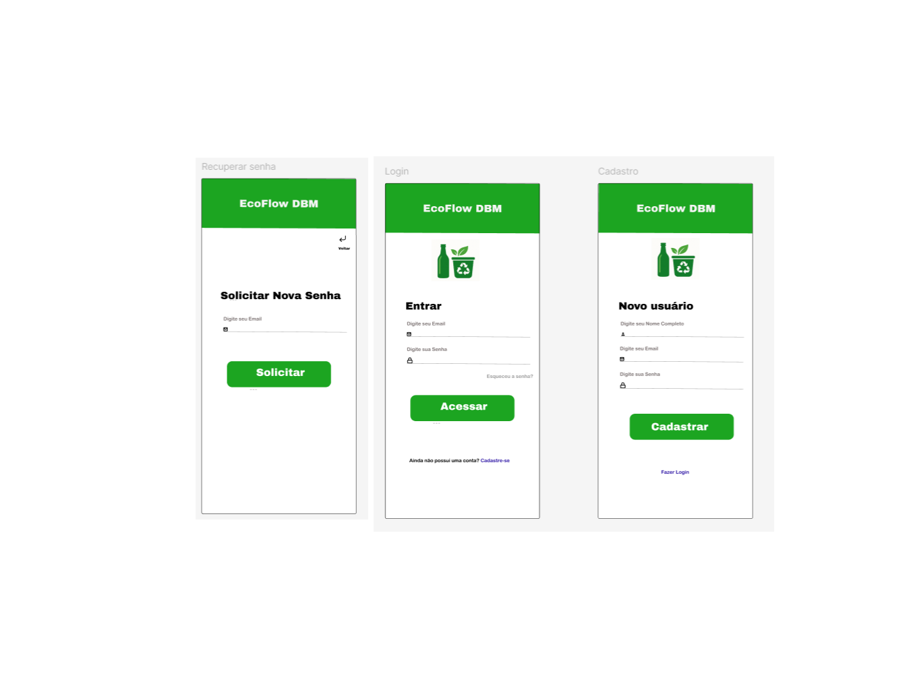
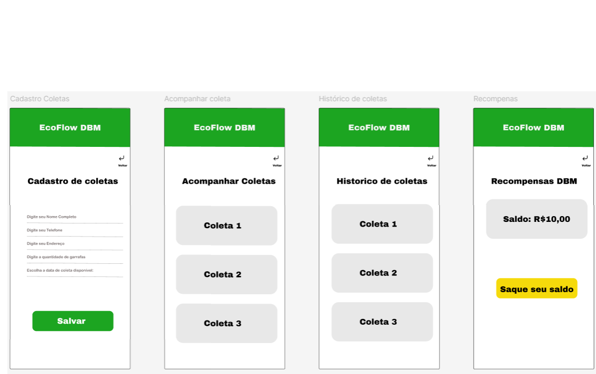
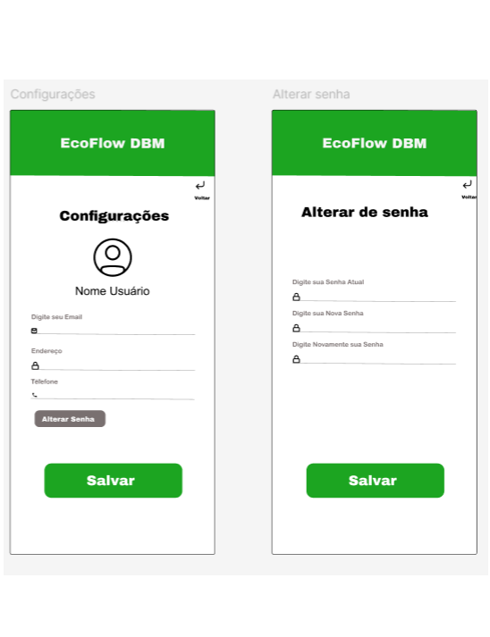
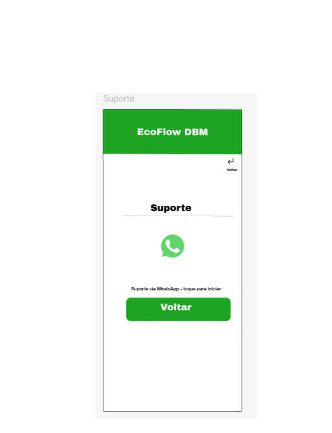
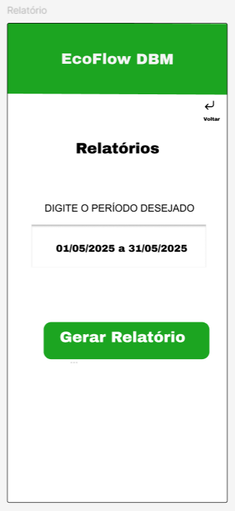

# Projeto de interface

Pré-requisitos: <a href="02-Especificacao.md"> Especificação do projeto</a>

Visão geral da interação do usuário pelas telas do sistema e protótipo interativo das telas com as funcionalidades que fazem parte do sistema (wireframes).

 Apresente as principais interfaces da plataforma. Discuta como ela foi elaborada de forma a atender os requisitos funcionais, não funcionais e histórias de usuário abordados na <a href="02-Especificacao.md"> Especificação do projeto</a>.

 ## User flow

Fluxo de usuário (user flow) é uma técnica que permite ao desenvolvedor mapear todo o fluxo de navegação do usuário na aplicação. Essa técnica serve para alinhar os caminhos e as possíveis ações que o usuário pode realizar junto com os membros da equipe.

### Diagrama de fluxo

 

## Wireframes

 

## Interface do sistema

Visão geral da interação do usuário por meio das telas do sistema. Apresente as principais interfaces da plataforma em sua versão final.

### Tela principal do sistema

Na tela principal o usuario podera acessar Configurações, Suporte, Cadastrar Coleta, Acompanhar Coletas, Histórico de coletas e Acessar a tela recompensas

 

###  Telas do processo 1 - LOGIN

O usuário poderá acessar o aplicativo com seu e-mail e senha, criar uma nova conta informando seus dados pessoais ou recuperar a senha caso tenha esquecido, garantindo acesso seguro e contínuo à plataforma EcoFlow DBM

### Telas do processo 2- Cadastrar, Acompanhar, Histórico, e Resgate de recompensas

Uma vez logado, o usuário terá acesso à tela principal, onde poderá cadastrar novas coletas, acompanhar coletas em andamento, consultar seu histórico e resgatar recompensas via Pix.

### Telas do processo 3- Configuração

Ao acessar a tela de configurações, o usuário poderá atualizar suas informações pessoais, como e-mail, telefone, endereço e senha, garantindo que seus dados estejam sempre atualizados.

### Telas do processo 4- Suporte
Ao acessar a tela de suporte, o usuário poderá entrar em contato direto com a equipe da EcoFlow DBM por meio do WhatsApp, recebendo atendimento rápido sempre que precisar de ajuda.

### Telas do processo 5- Emissão de relatório
A tela de Emissão de Relatório permite à DBM acessar informações gerenciais sobre o funcionamento do sistema. Nela, é possível visualizar a quantidade de coletas realizadas em determinado período.

