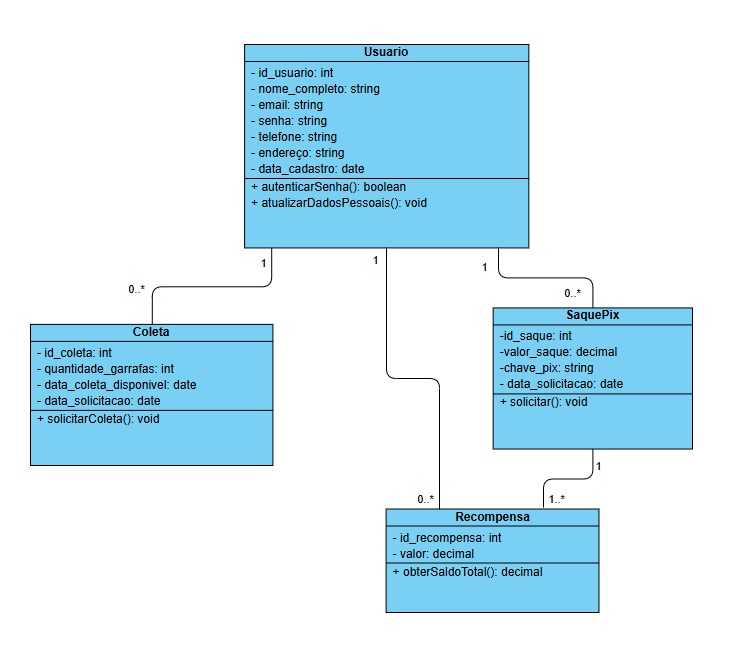
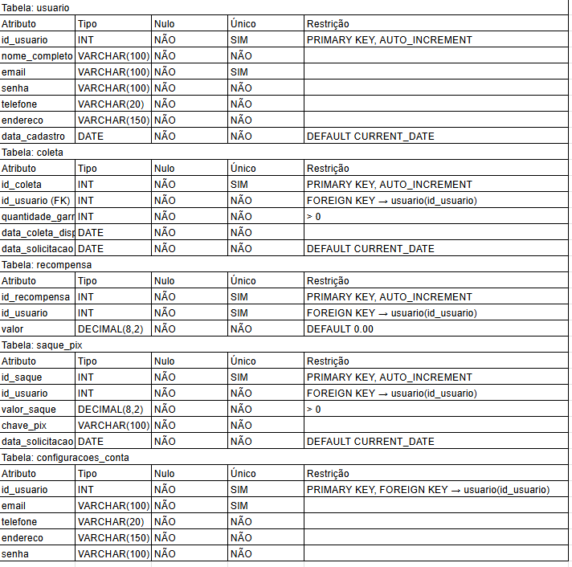
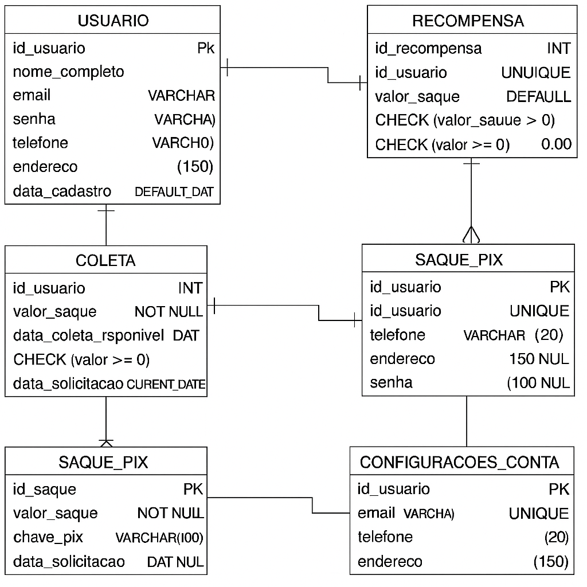
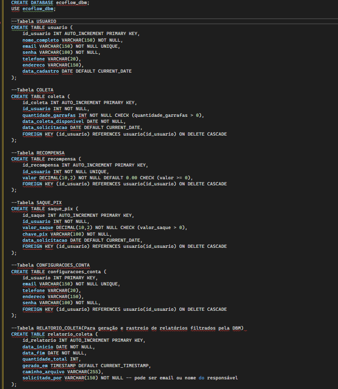

# Arquitetura da solução

Pré-requisitos: <a href="05-Projeto-interface.md"> Projeto de interface</a>

Definição de como o software é estruturado em termos dos componentes que fazem parte da solução e do ambiente de hospedagem da aplicação.

## Diagrama de classes

  

##  Modelo de dados

O desenvolvimento da solução proposta para a DBM (Distribuidora de Bebidas e Meio Ambiente) requer a criação de uma base de dados estruturada que viabilize o cadastro de usuários, agendamento e acompanhamento de coletas de garrafas retornáveis, gerenciamento de recompensas via Pix, configurações de conta e a geração de relatórios administrativos por parte da distribuidora. Essa base de dados permitirá a organização e controle de todos os processos identificados, garantindo integridade, segurança e rastreabilidade das informações.

Diagrama Entidade-Relacionamento (DER) em notação Peter Chen

Com a utilização da notação Peter Chen, foi elaborado o Diagrama Entidade-Relacionamento (DER) para representar graficamente as entidades envolvidas no projeto EcoFlow DBM, seus respectivos atributos e os relacionamentos existentes entre elas. O modelo contempla todas as funcionalidades previstas no sistema, como o cadastro de usuários, o agendamento de coletas, o controle de recompensas e a solicitação de saques via Pix.

Diagrama Entidade-Relacionamento (DER) em notação Pé de Galinha

O diagrama apresentado representa o modelo de dados do sistema EcoFlow DBM, utilizando a notação Pé de Galinha. Esse modelo contempla as principais funcionalidades da aplicação, como o cadastro de usuários, agendamento de coletas de vasilhames retornáveis, controle de recompensas, saques via Pix, configurações de conta e geração de relatórios por parte da distribuidora.

Cada entidade do sistema é representada com seus respectivos atributos e relacionamentos, garantindo uma visão clara da estrutura lógica do banco de dados. 

### Modelo físico

O modelo físico do banco de dados representa a implementação prática do modelo lógico, descrevendo em detalhes as estruturas reais que serão criadas no sistema gerenciador de banco de dados (SGBD) utilizado. No caso do projeto EcoFlow DBM, foi utilizado o MySQL para a criação e gerenciamento das tabelas, constraints e relacionamentos.

## Minimundo

Na jornada sustentável da EcoFlow DBM, a segurança, organização e coerência do sistema são pilares fundamentais. Para garantir que tudo funcione corretamente, algumas regras de negócio foram cuidadosamente definidas desde o início da concepção do sistema.

Tudo começa com o cadastro do usuário. Cada pessoa que se junta à plataforma precisa registrar um e-mail exclusivo, garantindo que não haja duplicidades no sistema. Além disso, para garantir o acesso seguro, o preenchimento da senha é obrigatório — ninguém consegue usar o sistema sem esse dado essencial.

Uma vez logado, o usuário tem acesso à funcionalidade principal: o cadastro de coletas. Ele pode realizar quantos cadastros quiser, pois o sistema permite que um único usuário registre várias coletas ao longo do tempo. No entanto, cada coleta sempre estará vinculada a apenas um usuário, reforçando a identidade individual das ações.

Para que a coleta seja válida, a data disponível precisa obrigatoriamente ser informada. O sistema não aceita coletas sem data definida e também não permite que o usuário cadastre uma data retroativa — afinal, não se pode agendar para o passado. Além disso, é necessário informar a quantidade de garrafas de vidro a serem entregues, e esse número precisa ser inteiro e maior que zero, respeitando o propósito sustentável da iniciativa.

Ao participar, o usuário acumula uma recompensa como reconhecimento por suas ações ambientais. Essa recompensa é representada por um saldo total, exclusivo para cada pessoa. Cada usuário possui apenas uma recompensa associada à sua conta, formando um relacionamento direto e único com essa funcionalidade.

Se desejar, o usuário pode sacar o valor acumulado via Pix. O sistema permite que ele realize diversos saques ao longo do tempo, mas cada saque pertence sempre a um único usuário. Para que o processo seja validado, é imprescindível informar uma chave Pix válida — esse campo é obrigatório para a liberação do pagamento.

Pensando na praticidade, a plataforma também oferece uma área de configurações da conta. Por lá, o usuário pode atualizar seus dados pessoais, como e-mail, telefone, endereço e senha. Esses são os únicos campos permitidos para alteração, mantendo a integridade e o controle das informações.

Além de todos esses recursos, a EcoFlow DBM se preocupa com a experiência do usuário em casos de dúvidas ou dificuldades. Para isso, o sistema disponibiliza um canal de suporte direto via WhatsApp, representado por um ícone na tela de atendimento. Ao clicar no botão, o usuário é automaticamente redirecionado para uma conversa com a equipe de suporte no aplicativo, permitindo um contato ágil, humanizado e eficiente. Essa solução reforça a acessibilidade e o compromisso da plataforma em oferecer ajuda rápida e clara sempre que necessário, sem complicações técnicas.

Por fim, pensando na gestão interna da distribuidora, o sistema oferece à equipe da DBM a possibilidade de filtrar e gerar relatórios de coletas realizadas por período.

## Tecnologias

Descreva qual(is) tecnologias você vai usar para resolver o seu problema, ou seja, implementar a sua solução. Liste todas as tecnologias envolvidas, linguagens a serem utilizadas, serviços web, frameworks, bibliotecas, IDEs de desenvolvimento, e ferramentas.

Apresente também uma figura explicando como as tecnologias estão relacionadas ou como uma interação do usuário com o sistema vai ser conduzida, por onde ela passa até retornar uma resposta ao usuário.

| **Dimensão**   | **Tecnologia**  |
| ---            | ---             |
| Front-end      | HTML + CSS + JS  |
| Back-end       | Node.js         |
| SGBD           | MySQL           |
| Deploy         | Vercel      |

## Hospedagem

Explique como a hospedagem e o lançamento da plataforma foram realizados.

> **Links úteis**:
> - [Website com GitHub Pages](https://pages.github.com/)
> - [Programação colaborativa com Repl.it](https://repl.it/)
> - [Getting started with Heroku](https://devcenter.heroku.com/start)
> - [Publicando seu site no Heroku](http://pythonclub.com.br/publicando-seu-hello-world-no-heroku.html)

## Qualidade de software

Conceituar qualidade é uma tarefa complexa, mas ela pode ser vista como um método gerencial que, por meio de procedimentos disseminados por toda a organização, busca garantir um produto final que satisfaça às expectativas dos stakeholders.

No contexto do desenvolvimento de software, qualidade pode ser entendida como um conjunto de características a serem atendidas, de modo que o produto de software atenda às necessidades de seus usuários. Entretanto, esse nível de satisfação nem sempre é alcançado de forma espontânea, devendo ser continuamente construído. Assim, a qualidade do produto depende fortemente do seu respectivo processo de desenvolvimento.

A norma internacional ISO/IEC 25010, que é uma atualização da ISO/IEC 9126, define oito características e 30 subcaracterísticas de qualidade para produtos de software. Com base nessas características e nas respectivas subcaracterísticas, identifique as subcaracterísticas que sua equipe utilizará como base para nortear o desenvolvimento do projeto de software, considerando alguns aspectos simples de qualidade. Justifique as subcaracterísticas escolhidas pelo time e elenque as métricas que permitirão à equipe avaliar os objetos de interesse.

