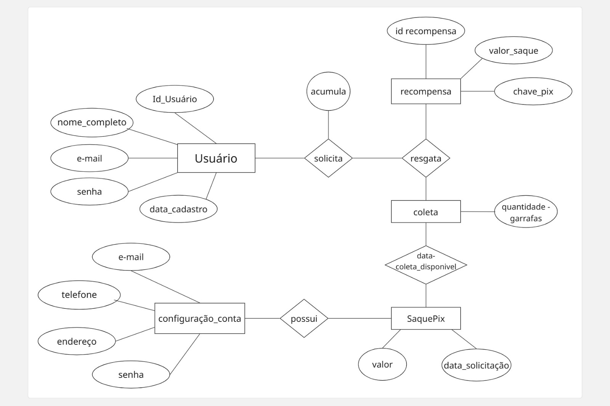

# Arquitetura da solução

A aplicação EcoFlow DBM foi desenvolvida com base em uma arquitetura moderna e eficiente, integrando tecnologias amplamente utilizadas no desenvolvimento web. O frontend da aplicação é construído utilizando HTML, CSS e JavaScript, garantindo uma interface amigável, responsiva e acessível aos usuários. Esses arquivos são executados diretamente no navegador do usuário, com apoio do armazenamento local para facilitar a experiência de uso e reter dados temporários como status de coleta, preferências e dados de login. O backend da aplicação é desenvolvido com Node.js, responsável por gerenciar as regras de negócio, autenticação, processamento de requisições e comunicação com o banco de dados. O sistema utiliza o MySQL Workbench para armazenar de forma segura e organizada os dados dos usuários, coletas, recompensas e transações, permitindo consultas otimizadas e integridade das informações.

Para garantir a disponibilidade da plataforma, a hospedagem é realizada na Azure, que oferece escalabilidade, segurança e estabilidade para o funcionamento da aplicação em ambiente de produção. A comunicação entre o frontend e o backend ocorre via API REST, permitindo uma separação clara de responsabilidades e facilitando futuras integrações com novos módulos ou serviços. Toda a estrutura foi planejada para manter uma boa performance, mesmo com o aumento da base de usuários, permitindo que a EcoFlow DBM atenda de maneira sustentável a demanda de coleta de vasilhames e gerenciamento de recompensas em tempo real, promovendo o engajamento ecológico por meio da tecnologia.

---

###  1. Camada de Apresentação (Frontend / Aplicativo Web Responsivo)

Responsável pela interação com o usuário e exibição das interfaces do sistema.

- **Telas:** Login, Cadastro, Recuperação de Senha, Dashboard, Cadastro de Coleta, Histórico de Coleta, Acompanhar Coleta, Recompensas, Suporte, Configurações, Relatórios.
- **Framework :** React.js

**Funcionalidades:**
- Envio de dados para a API (coletas, saques, atualizações).
- Redirecionamento para suporte via WhatsApp.
- Exibição de informações, histórico, recompensas e relatórios gerenciais.

---

###  2. Camada de Aplicação (Backend / API REST)

Responsável pelas regras de negócio, validações e comunicação entre frontend e banco de dados.

- **Linguagem :** Node.js

**Funcionalidades:**
- Autenticação, segurança e controle de acesso.
- Gerenciamento de coletas, recompensas, saques e perfis.
- Validações lógicas (ex: data de coleta futura, chave Pix obrigatória).
- Envio de e-mails para recuperação de senha.
- Integração com serviços externos (ex: sistema de pagamentos via Pix).
- **Geração de relatórios personalizados pela DBM**, como:
  - Quantidade de coletas realizadas por período.
  - Dados estatísticos exportáveis (CSV).

---

### 3. Camada de Persistência (Banco de Dados Relacional)

Responsável por armazenar os dados da aplicação de forma segura e estruturada.

- **SGBD definido:** MySQL

**Modelagem baseada em:**
- **Modelo Conceitual:** Notação de Peter Chen
- **Modelo Lógico:** Notação Pé de Galinha
- **Script SQL:** Criação de tabelas e restrições

**Entidades principais:**
- Usuário
- Coleta
- Recompensa
- SaquePix

**Regras de integridade:** unicidade, integridade referencial, obrigatoriedade, domínios de valores.

---

###  4. Serviços Externos

Serviços conectados à aplicação para ampliar funcionalidades e eficiência.

- **WhatsApp API:** Canal de atendimento direto para suporte ao usuário.
- **Pix API (opcional):** Transferência direta de recompensas acumuladas.
- **GitHub Projects:** Ferramenta de gestão de projeto com quadros Kanban e metodologia Scrum.

---

###  5. Segurança

Mecanismos para garantir a proteção dos dados e das comunicações.

- Criptografia de senhas
- Conexão segura com HTTPS

## Diagrama de classes

Diagrama que representa a estrutura estática do sistema, mostrando classes, atributos, métodos e relacionamentos para gestão de garrafas retornáveis, pontos e estabelecimentos comerciais.

  

##  Modelo de dados

O desenvolvimento da solução proposta para a DBM (Distribuidora de Bebidas e Meio Ambiente) requer a criação de uma base de dados estruturada que viabilize o cadastro de usuários, agendamento e acompanhamento de coletas de garrafas retornáveis, gerenciamento de recompensas via Pix, configurações de conta e a geração de relatórios administrativos por parte da distribuidora. Essa base de dados permitirá a organização e controle de todos os processos identificados, garantindo integridade, segurança e rastreabilidade das informações.

Diagrama Entidade-Relacionamento (DER) em notação Peter Chen

Com a utilização da notação Peter Chen, foi elaborado o Diagrama Entidade-Relacionamento (DER) para representar graficamente as entidades envolvidas no projeto EcoFlow DBM, seus respectivos atributos e os relacionamentos existentes entre elas. O modelo contempla todas as funcionalidades previstas no sistema, como o cadastro de usuários, o agendamento de coletas, o controle de recompensas e a solicitação de saques via Pix.

  

Diagrama Entidade-Relacionamento (DER) em notação Pé de Galinha

O diagrama apresentado representa o modelo de dados do sistema EcoFlow DBM, utilizando a notação Pé de Galinha. Esse modelo contempla as principais funcionalidades da aplicação, como o cadastro de usuários, agendamento de coletas de vasilhames retornáveis, controle de recompensas, saques via Pix, configurações de conta e geração de relatórios por parte da distribuidora.

Cada entidade do sistema é representada com seus respectivos atributos e relacionamentos, garantindo uma visão clara da estrutura lógica do banco de dados. 

### Modelo físico

O modelo físico do banco de dados representa a implementação prática do modelo lógico, descrevendo em detalhes as estruturas reais que serão criadas no sistema gerenciador de banco de dados (SGBD) utilizado. No caso do projeto EcoFlow DBM, foi utilizado o MySQL para a criação e gerenciamento das tabelas, constraints e relacionamentos.

## Tecnologias

Descreva qual(is) tecnologias você vai usar para resolver o seu problema, ou seja, implementar a sua solução. Liste todas as tecnologias envolvidas, linguagens a serem utilizadas, serviços web, frameworks, bibliotecas, IDEs de desenvolvimento, e ferramentas.

Apresente também uma figura explicando como as tecnologias estão relacionadas ou como uma interação do usuário com o sistema vai ser conduzida, por onde ela passa até retornar uma resposta ao usuário.

| **Dimensão**   | **Tecnologia**  |
| ---            | ---             |
| Front-end      | HTML + CSS + JS  |
| Back-end       | Node.js         |
| SGBD           | MySQL           |
| Deploy         | Azure      |

## Hospedagem

Explique como a hospedagem e o lançamento da plataforma foram realizados.

> **Links úteis**:
> - [Website com GitHub Pages](https://pages.github.com/)
> - [Programação colaborativa com Repl.it](https://repl.it/)
> - [Getting started with Heroku](https://devcenter.heroku.com/start)
> - [Publicando seu site no Heroku](http://pythonclub.com.br/publicando-seu-hello-world-no-heroku.html)

## Qualidade de software

A busca pela qualidade no desenvolvimento de software é essencial para garantir que o produto atenda às necessidades dos usuários finais e mantenha sua eficácia ao longo do tempo. De acordo com a norma ISO/IEC 25010, a qualidade de um software pode ser avaliada com base em um conjunto de características e subcaracterísticas que abrangem desde o desempenho técnico até a experiência do usuário.

No projeto EcoFlow DBM, que visa facilitar a logística reversa de garrafas retornáveis, a adoção de critérios de qualidade é ainda mais importante, pois envolve a confiabilidade dos dados, segurança das informações, usabilidade e a integridade das operações. Tendo em vista a limitação de tempo e recursos, a equipe adotará algumas subcaracterísticas específicas da norma ISO/IEC 25010, que melhor se adequam ao escopo e à criticidade do sistema.

| característica  | Justificativa                                                                 | Métricas de Avaliação                              |
|--------------------|-------------------------------------------------------------------------------|----------------------------------------------------|
| Apreensibilidade   | Facilitar o entendimento inicial do sistema por novos usuários.              | Testes de usabilidade e tempo médio de adaptação   |
| Operacionalidade   | Permitir que os usuários realizem ações básicas com facilidade.              | Percentual de tarefas realizadas sem ajuda         |
| Confidencialidade  | Proteger informações sensíveis como e-mail, telefone e endereço.             | Verificação de autenticação e criptografia         |
| Integridade        | Garantir que dados não sejam corrompidos ou alterados de forma indevida.     | Testes de integridade e consistência dos dados     |
| Tempo de resposta  | Assegurar agilidade nas ações do aplicativo, principalmente em mobile.       | Tempo médio de carregamento das funcionalidades    |
| Maturidade         | Promover estabilidade após atualizações e testes iniciais.                   | Número de falhas ou erros após implantação         |
| Modularidade       | Permitir fácil manutenção e evolução do sistema no futuro.                   | Análise de coesão entre módulos e documentação     |

