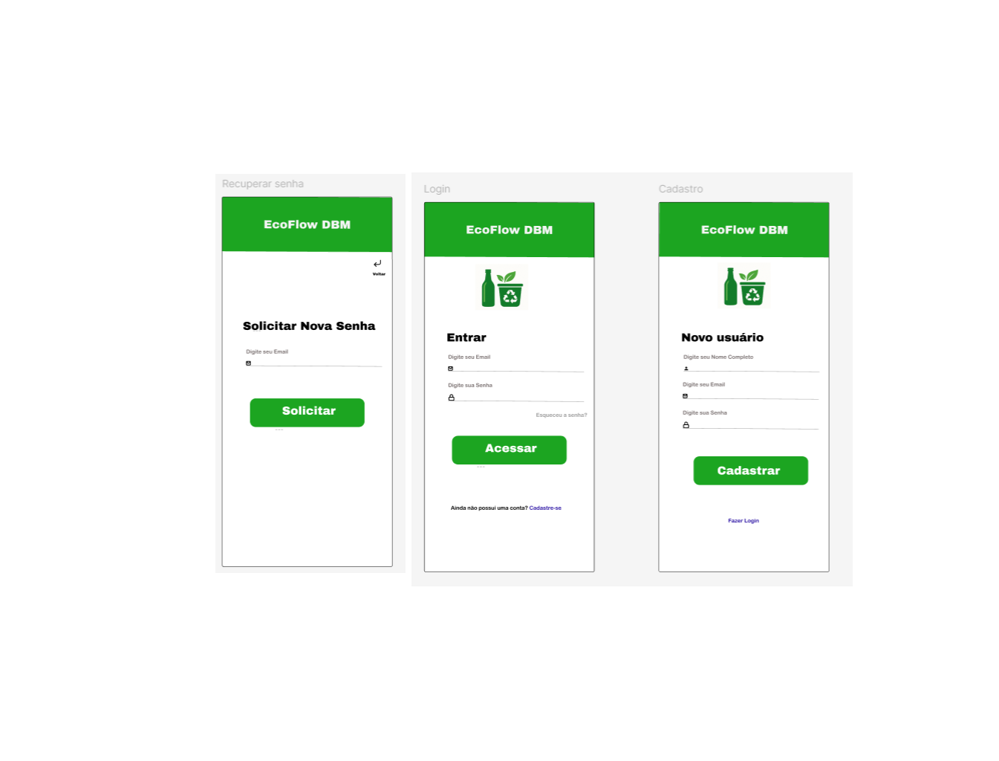

# Plano de testes de software

Este documento descreve os casos de teste elaborados para validação da aplicação EcoFlow DBM, sistema de gestão para devolução de garrafas retornáveis com programa de recompensas. Os testes foram projetados para verificar os requisitos funcionais e não-funcionais do sistema, garantindo que todas as features implementadas atendam aos critérios de qualidade esperados tanto pela equipe de desenvolvimento quanto pelos stakeholders do projeto. 

A estrutura de testes segue metodologia baseada em requisitos, onde cada caso está vinculado a um item específico da documentação de especificações (RF-XXX). Foram priorizados os fluxos críticos do sistema, incluindo processos de autenticação, gestão de coletas, cálculo de saldo e integrações externas, com abordagem que cobre testes positivos, negativos e de validação de regras de negócio. 

Cada caso de teste contém: identificador único (CT-XXX), pré-condições claras, passos de execução detalhados, critérios de aprovação mensuráveis e evidências obrigatórias. A organização em tabelas padronizadas permite fácil rastreabilidade e execução pelos membros da equipe de QA, sendo Lucas Silva e Robson Rodrigues os responsáveis primários pela elaboração e validação dos testes. 
 

# Casos de Teste - Aplicação EcoFlow DBM

## CT-001 – Acesso à página inicial
| Campo                 | Conteúdo                                                                 |
|-----------------------|--------------------------------------------------------------------------|
| **Requisito**         | RF-000                                                                  |
| **Objetivo**          | Verificar carregamento da página principal                              |
| **Passos**            | 1. Acessar URL 2. Verificar elementos 3. Medir tempo de resposta  |
| **Critério de Êxito** | - Load <3s - Elementos visíveis                                      |
| **Responsável**       | Lucas Silva                                                             |
| **Evidência**         |                                              |

---

## CT-002 – Login válido
| Campo                 | Conteúdo                                                                 |
|-----------------------|--------------------------------------------------------------------------|
| **Requisito**         | RF-001                                                                  |
| **Objetivo**          | Testar autenticação com credenciais corretas                            |
| **Passos**            | 1. Inserir e-mail válido 2. Inserir senha correta 3. Submeter     |
| **Critério de Êxito** | - Redireciona para dashboard - Cookie de sessão criado               |
| **Responsável**       | Robson Rodrigues                                                        |
| **Evidência**         |                                              |

---

## CT-003 – Login inválido
| Campo                 | Conteúdo                                                                 |
|-----------------------|--------------------------------------------------------------------------|
| **Requisito**         | RF-001                                                                  |
| **Objetivo**          | Verificar tratamento de credenciais incorretas                          |
| **Passos**            | 1. Inserir e-mail inválido 2. Submeter formulário                    |
| **Critério de Êxito** | - Exibe mensagem de erro - Bloqueia após 3 tentativas                |
| **Responsável**       | Lucas Silva                                                             |
| **Evidência**         |                                              |

---

## CT-004 – Cadastro de usuário
| Campo                 | Conteúdo                                                                 |
|-----------------------|--------------------------------------------------------------------------|
| **Requisito**         | RF-002                                                                  |
| **Objetivo**          | Validar fluxo de registro                                               |
| **Passos**            | 1. Preencher formulário 2. Aceitar termos 3. Confirmar e-mail     |
| **Critério de Êxito** | - Conta criada no banco - E-mail de confirmação enviado              |
| **Responsável**       | Robson Rodrigues                                                        |
| **Evidência**         |                                              |

---

## CT-005 – Recuperação de senha
| Campo                 | Conteúdo                                                                 |
|-----------------------|--------------------------------------------------------------------------|
| **Requisito**         | RF-003                                                                  |
| **Objetivo**          | Testar reset de senha                                                   |
| **Passos**            | 1. Solicitar recuperação 2. Acessar link do e-mail 3. Nova senha  |
| **Critério de Êxito** | - Link expira em 24h - Senha é atualizada                            |
| **Responsável**       | Lucas Silva                                                             |
| **Evidência**         |                                              |

---

## CT-006 – Agendamento de coleta
| Campo                 | Conteúdo                                                                 |
|-----------------------|--------------------------------------------------------------------------|
| **Requisito**         | RF-004                                                                  |
| **Objetivo**          | Verificar cadastro de coletas                                           |
| **Passos**            | 1. Selecionar tipo 2. Informar endereço 3. Escolher data/hora     |
| **Critério de Êxito** | - Coleta aparece no calendário - Notificação enviada                 |
| **Responsável**       | Robson Rodrigues                                                        |
| **Evidência**         |                                              |

---

## CT-007 – Cancelamento de coleta
| Campo                 | Conteúdo                                                                 |
|-----------------------|--------------------------------------------------------------------------|
| **Requisito**         | RF-005                                                                  |
| **Objetivo**          | Testar remoção de agendamentos                                          |
| **Passos**            | 1. Acessar agendamento 2. Clicar "Cancelar" 3. Confirmar          |
| **Critério de Êxito** | - Coleta é removida - E-mail de confirmação enviado                  |
| **Responsável**       | Lucas Silva                                                             |
| **Evidência**         |                                              |

---

## CT-008 – Consulta de saldo
| Campo                 | Conteúdo                                                                 |
|-----------------------|--------------------------------------------------------------------------|
| **Requisito**         | RF-006                                                                  |
| **Objetivo**          | Verificar exibição de saldo acumulado                                   |
| **Passos**            | 1. Acessar perfil 2. Navegar para "Saldo"                            |
| **Critério de Êxito** | - Valor exato é exibido - Atualizado em tempo real                   |
| **Responsável**       | Robson Rodrigues                                                        |
| **Evidência**         |                                              |

---

## CT-009 – Resgate de saldo
| Campo                 | Conteúdo                                                                 |
|-----------------------|--------------------------------------------------------------------------|
| **Requisito**         | RF-007                                                                  |
| **Objetivo**          | Testar conversão de saldo em benefícios                                 |
| **Passos**            | 1. Selecionar recompensa 2. Confirmar resgate 3. Verificar e-mail |
| **Critério de Êxito** | - Saldo debitado - Voucher gerado                                    |
| **Responsável**       | Lucas Silva                                                             |
| **Evidência**         |                                              |

---

## CT-010 – Alteração de senha
| Campo                 | Conteúdo                                                                 |
|-----------------------|--------------------------------------------------------------------------|
| **Requisito**         | RF-008                                                                  |
| **Objetivo**          | Validar atualização de senha                                            |
| **Passos**            | 1. Acessar "Segurança" 2. Inserir senha atual 3. Cadastrar nova   |
| **Critério de Êxito** | - Senha alterada - Requer login com nova credencial                  |
| **Responsável**       | Robson Rodrigues                                                        |
| **Evidência**         |                                              |

---

## CT-011 – Logout
| Campo                 | Conteúdo                                                                 |
|-----------------------|--------------------------------------------------------------------------|
| **Requisito**         | RF-009                                                                  |
| **Objetivo**          | Testar encerramento de sessão                                           |
| **Passos**            | 1. Clicar em "Sair" 2. Tentar acessar área restrita                  |
| **Critério de Êxito** | - Sessão invalidada - Redireciona para login                         |
| **Responsável**       | Lucas Silva                                                             |
| **Evidência**         |                                              |

---

## CT-012 – Relatório de coletas
| Campo                 | Conteúdo                                                                 |
|-----------------------|--------------------------------------------------------------------------|
| **Requisito**         | RF-010                                                                  |
| **Objetivo**          | Verificar geração de documentos                                         |
| **Passos**            | 1. Filtrar por período 2. Selecionar formato 3. Gerar relatório   |
| **Critério de Êxito** | - Arquivo download - Dados consistentes                              |
| **Responsável**       | Robson Rodrigues                                                        |
| **Evidência**         |                                              |

---

## CT-013 – Integração com WhatsApp
| Campo                 | Conteúdo                                                                 |
|-----------------------|--------------------------------------------------------------------------|
| **Requisito**         | RF-011                                                                  |
| **Objetivo**          | Validar canal de suporte                                                |
| **Passos**            | 1. Clicar em "Ajuda" 2. Iniciar chat 3. Enviar mensagem teste     |
| **Critério de Êxito** | - Chat aberto - Mensagem recebida                                    |
| **Responsável**       | Lucas Silva                                                             |
| **Evidência**         |                                              |

---

## CT-014 – Aprovação de coletas (admin)
| Campo                 | Conteúdo                                                                 |
|-----------------------|--------------------------------------------------------------------------|
| **Requisito**         | RF-012                                                                  |
| **Objetivo**          | Validar fluxo administrativo                                            |
| **Passos**            | 1. Login como admin 2. Aprovar coleta 3. Verificar status         |
| **Critério de Êxito** | - Status atualizado - Usuário notificado                             |
| **Responsável**       | Robson Rodrigues                                                        |
| **Evidência**         |                                              |

---

## CT-015 – Responsividade
| Campo                 | Conteúdo                                                                 |
|-----------------------|--------------------------------------------------------------------------|
| **Requisito**         | RF-013                                                                  |
| **Objetivo**          | Verificar adaptação a diferentes telas                                  |
| **Passos**            | 1. Testar em mobile 2. Verificar tablet 3. Checar desktop         |
| **Critério de Êxito** | - Layout responsivo - Funcionalidades acessíveis                     |
| **Responsável**       | Lucas Silva                                                             |
| **Evidência**         |                                              |

Os resultados obtidos nesta bateria de testes servirão como base para a liberação das versões em ambiente de homologação e produção, além de fornecer métricas objetivas sobre a maturidade do sistema. Recomenda-se a execução completa desta suite antes de cada deploy significativo no ambiente produtivo. 
